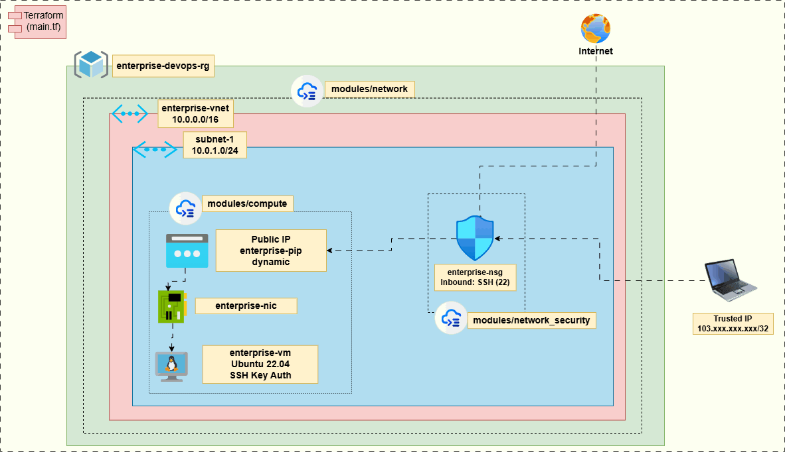

## Purpose

This repository was created to demonstrate production-style Infrastructure as Code (IaC) practices on Microsoft Azure using Terraform. The project showcases modular infrastructure design, network security, and secure compute provisioning commonly found in enterprise cloud environments.

# Enterprise Azure Infrastructure (Terraform)
This project demonstrates a production-style Azure infrastructure deployed using Terraform modules. It includes networking, security, and compute layers designed following Infrastructure as Code (IaC) best practices.

## Architecture

The infrastructure is deployed using a modular Terraform design:

- modules/network
  - Virtual Network
  - Subnet

- modules/network-security
  - Network Security Group
  - Security Rules

- modules/compute
  - Public IP
  - Network Interface
  - Linux Virtual Machine

SSH access is restricted to trusted source IPs and authentication is enforced using SSH keys.

## 🧭 Architecture Diagram



## Repository Structure

```text
modules/
├── network/            # VNet + Subnet
├── network-security/   # NSG + Security Rules
└── compute/            # VM + NIC + Public IP
```

## Security

- SSH key-based authentication (no password login)
- NSG restricted to specific IP address
- Subnet-level security enforcement
- Least privilege access model

## Tech Stack

- Terraform
- Azure Provider (azurerm)
- Microsoft Azure (VM, VNet, NSG)
- SSH authentication

## Deployment Steps

1. terraform init
2. terraform plan
3. terraform apply

## Key Learnings

- Terraform module design and reuse
- Azure networking fundamentals (VNet, Subnet, NSG)
- Secure VM provisioning with SSH keys
- Infrastructure state management concepts

## Highlights

✔ Modular Terraform architecture  
✔ Production-style Azure design  
✔ Secure VM provisioning (SSH key authentication)  
✔ Network isolation using NSG  
✔ Clean separation of concerns (network / compute / security)

## Infrastructure Components

- 1 Resource Group
- 1 Virtual Network
- 1 Subnet
- 1 Network Security Group
- 1 Public IP
- 1 Network Interface
- 1 Linux Virtual Machine

## Summary

This project simulates a production-style Azure infrastructure environment built using Terraform. It demonstrates modular Infrastructure as Code practices, secure network design, SSH key-based VM access, and Azure resource provisioning patterns commonly used in enterprise cloud environments.